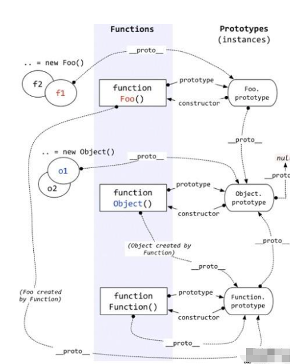
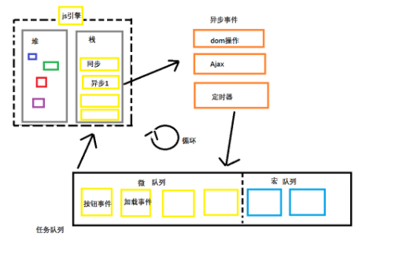

# 高级 Js

### 变量和常量

      1. 变量:用来存放数据,保存的数据可以修改
      2. 常量:用来存放数据,保存的数据不可修改
      3. 变量和常量的本质,无论是变量还是常量,其本身都是数据,也需要在内存中占用内存空间,保存在内存的栈结构分区中

### 数据类型

      1.ECMAScript标准定义了8种数据类型
        - 7种原始数据类型
        - String,Numbr,Boolean,Undefined,null,Symbol,BigInt
        - 和Object

### 基本数据类型(简单数据类型)

      1. 基本数据类型
        - string,number,boolean,undefined,null

### 引用数据类型(复杂(复合)数据类型)

      1. 引用数据类型
        - Object,Function,Array

### typeof 运算符(判断数据的类型)

      # 1. 作用:用来获取当前变量中存储的数据的类型
      2. typeof的返回值有多少个
        - String,Number,Boolean,Undefined,Object,Function
        - 特殊的有两个:null和array的结果都是Object

### instanceOf 运算符(原生 JS 判断实例的类型)

      1. 作用:用来判断当前实例对象是不是某种数据类型

### 基本数据类型和引用数据类型在内存中,内存空间是如何存储数据的

      1. 除 Object 以外的所有类型都是不可变的（值本身无法被改变）,JavaScript 中字符串是不可变的（译注：如，JavaScript 中对字符串的操作一定返回了一个新字符串，原始字符串并没有被改变）。我们称这些类型的值为“原始值”。
      2. 基本数据类型的值在栈空间中存储,如果修改了数据,则是把原来的值直接干掉,重新存放新的值
      3. 引用数据类型的对象在堆空间中存储,该空间的地址在栈空间中存储,如果修改栈空间存储的地址,则指向发生变化,也叫引用发生了变化,此时是在堆空间中重新指向了一个新的内存空间(存储了一个新的对象)
      4. 基本类型之间的值如何传递? 传递的是数值
      5. 引用类型之间的值如何传递? 传递的是引用(地址)

### 内存:用于暂时存放 CPU 中的运算数据以及与硬盘等外部存储器交换的数据

      1. 计算机在运行中，CPU就会把需要运算的数据调到内存中进行运算，当运算完成后CPU再将结果传送出来，内存的运行也决定了计算机的稳定运行。
      2. 内存通电后产生的存储空间(临时的)
      3. 产生和死亡:内存条(集成电路板)--->通电--->产生一定的容量存储空间--->存储各种数据--->断电--->内存空间全部消失
      4. 内存的空间是临时的,而硬盘的空间是持久的
      5. 内存包含2个数据:内存存储的数据(一般数据/地址数据)和内存地址值数据
      6. 内存分类:
        - 栈结构: 全局变量，局部变量(空间较小)
        - 堆结构(列表结构): 对象 (空间较大)

### 函数:代码的重用,分为:函数声明及函数表达式,一个函数最好是代表的是一个功能

        - 函数可以隔离变量,减少命名冲突(命名污染)
      1. 函数声明
        - function f1() {}
      2. 函数表达式:
        - var fn =function (){}
      3. 函数调用的方式:
        - 直接调用 fn()
        - 对象调用 obj.sayHi()
        - new 构造函数 new Object()
        - apply/call/bind 调用 f1.call(this,num1,num2), 改变this的指向

### 回调函数:定了,没有直接调用,但是最后执行了

      1. 常见的回调
        - DOM事件的回调
        - 定时器中的回调
        - ajax回调函数(后面讲)
        - 生命周期的回调(后面讲)
      2. 立即执行函数(Immediately-Invokey Function Expression) 匿名函数自调用
        - (function (){})()
        - 作用:隐藏内部实现,减少命名空间的污染

### 总结函数:

      1. 函数也是对象(原型可以体现出来)
      2. 函数具备行为,可以被调用
      3. 函数:普通函数,构造函数,匿名函数(自调用:IIFE)
      4. 回调函数(事件的回调,定时器的回调)

### this:首先是一个关键字,其实也是一个特殊的变量

      1. 提前定义好的,内置变量,特殊的一个关键字
      2. 全局的this:window
      3. 函数中的this:
        - 默认函数中的this是window
        - 方法中的this是当前的实例对象
        - 原型对象中的this是当前的实例对象
      4. 本质上任何函数在执行时都是通过某个对象调用的
      5. this怎么确定?函数调用的时候才能确定this是谁

### 预解析

      1. js引擎在js代码正式执行之前会做一些预解析的操作
      2. 先找关键字var,function
      3. 找到var以后将var后面的变量提前声明,但是不赋值
      4. 找到function以后将function后面的函数提前声明,但是不赋值,也就是说函数在解析之前已经定义完毕了
      5. 变量的提升
        - 浏览器在解析js代码之前,先把变量的声明提升
      6. 函数的提升
        - 浏览器在解析js代码之前,先把函数的声明提升
      7. 注意:f2() var f2=function(){}; 报错:因为f2是undefined
      8. 预解析:全局预解析和局部预解析

### debug

      1. debugger 调试 :直接在代码中书写debugger
      2. 断点调试 : 浏览器中Sources中使用断点方式

### null

      1. 什么情况为null?
        - 当一个对象需要释放的时候,或者叫对象不需要使用了(或者一个变量的值不需要了),此时可以设置为null
        - 当一个对象需要释放的时候,可以手动的设置为null,此时垃圾回收机制就可以回收了,内存也就释放出来了
        - 垃圾回收器
        - var obj={} obj = null

### 执行上下文(动态的):就是一个代码的执行环境(全局执行上下文和函数执行上下文,eval 函数执行上下文)

      1. 执行上下文概念:代表了代码执行的环境,包含:执行环境,变量对象,this,作用域链
      2. 流程:
        - js引擎在js代码正式执行前会先创建一个执行环境
        - 进入该环境以后会创建一个变量对象,该对象用于收集:变量,函数,函数的参数,this
        - 找关键字var,function
        - 确认this
        - 创建作用域链
      3. 在全局代码执行前,js引擎就会创建一个栈来存储管理所有的执行上下文
      4. 在全局执行上下文(window)确定后,将其添加到栈中(压栈)
      5. 在函数执行上下文创建后,将其添加到栈中(压栈)
      6. 在当前函数执行完毕后,将栈顶的对象移除(出栈)
      7. 当所有的代码执行完毕后,栈中只剩下window
      8. 重点:执行上下文是动态创建的,尤其是针对函数,每调用一次函数都会创建一次执行上下文


      9. 总结执行上下文: 当代码要执行,但是没有执行,或者将要执行,在预解析之后,此时出现了全局执行上下文环境(全局执行上下文),创建了一个变量对象,用来收集var , function ,函数参数,确定this的指向,默认全局执行上下文是确定了this是window,这个变量对象会被压入到栈中(全局执行上下文的变量对象在栈中的最下面),如果出现了函数调用,此时出现了局部执行上下文环境(局部执行上下文),再次创建一个变量对象,用来收集函数参数,var ,function,改变this的指向,这个变量对象会被再次压入栈中,在全局执行上下文的变量对象的上面,如果当前函数调用完毕,此时出栈(把局部上下文的变量对象干掉),依次弹出变量对象,就结束了

### 作用域(虚拟概念):变量的使用范围,静态的(编写代码的时候就已经确定了)

      1. 全局作用域和局部作用域
      2. 全局作用域:函数外部变量的使用范围
      3. 局部作用域:函数内变量的使用范围(一个函数就是一个作用域)
      4. 没有块级作用域(ES6)就有了
      5. 作用:隔离变量,不同的作用域下同名的变量不会冲突
      6. 变量分为:全局变量(非函数内部定义的变量)和局部变量(函数内部定义的变量)

### 作用域与执行上下文

      1. 全局作用域之外,每个函数都会创建自己的作用域,作用域在函数定义时已经确定了,而不是函数调用时
      2. 全局执行上下文环境在全局作用域确定之后,js代码马上执行之前创建
      3. 函数执行上下文环境是在调用函数时,函数体代码执行之前创建
      4. 作用域是静态的,只要函数定义好了就一直存在,且不会再变化
      5. 执行上下文是动态的,调用函数时创建,函数调用结束时上下文环境就会释放
      6. 上下文环境(对象)是从属于所在的作用域
      7. 全局上下文环境-->全局作用域

### 作用域链(用来查找变量的)

      1. 用来决定代码执行的范围,变量的作用范围
      2. 作用域是代码定义的时候决定的
      3. 作用域链是如何产生的
        - 函数在定义的时候自动添加一个属性'[[Scopes]]'该属性保存的是其上级作用域链
        - 当函数执行的时候,进入执行上下文环境,将创建的变量对象添加到'[[Scopes]]'数组的第一个位置,形成新的数组
      4. 查找变量的规则
        - 先在当前作用域的变量对象中查找,找到则使用
        - 如果没有则沿着作用域链的数组去上级作用域中的变量对象中查找
        - 找到就返回对应的值,如果没有继续向上查找,知道找到最后一个变量对象(全局的变量对象),如果没有则报错

### 总结执行上下文和作用域

    变量的查找:
    代码编写的时候确定了当前全局作用域及局部作用域
    在代码马上执行,还没执行,执行上下文环境就出现了,函数调用完毕后,局部执行上下文没了,整个代码结束,全局的执行上下文环境也没了
    全局作用域---->预解析--->全局执行上下文环境--->全局的变量对象{var ,function ,函数参数,this的指向}----->函数定义---->局部作用域---->出现了函数调用----->局部局解析--->局部的执行上下文环境---->局部的变量对象{var ,function ,函数参数,this的指向}

    -- 注意问题:函数中定义函数,内部函数没有调用,则不会出现在局部执行上下文的变量对象中

### 编程思想:面向对象和面向过程

      1. 面向过程:
      2. 面向对象:

### 对象:具有一定的属性或者方法,特指的某个事物

    1. 看得见或者是摸得到,特指的某个东西
    2. 识别对象,抽象出对象有什么特征和行为
    3. 抽象出当前的对象属于什么类别
    4. 以上都是抽象出对象和类别的过程,抽象性
    5. 抽象的过程要转变成代码的方式,写代码:先有类别(构造函数),创建对象并设置对象的属性及方法的初始值,对象的初始化过程,最终对象调用相关方法,操作相关属性及某些行为
    6. 特征就是属性,行为就是方法,类别就是构造函数,创建对象就是实例化的过程(初始化属性及方法的中)

### 创建对象的不同方式:

    1. 工厂模式:自定义函数实现对象的创建
    2. 通过构造函数实现对象的创建
    3. 字面量的方式创建对象
    4. 单例模式:和null是否有关系

### 属性访问的方式:

    1. 对象.属性名字
    2. 对象['属性名字']
    3. 什么时候使用对象[属性名字]的写法
      - 不确定属性名字是什么(属性名字是变量)
      - 属性名字不太规范的时候

### 原型:指的是原型对象,一共有两个,prototype 和**proto**

      1. 原型就是对象,JS中原型一共有两个,一个是prototype，一个是__proto__,
        - prototype: 浏览器的标准属性,程序员使用的,显示原型,存在于函数中
        - __proto__: 浏览器的非标准属性,浏览器使用的,隐式原型,存在于实例对象中
        - 函数中有prototype,实例对象中有__proto__
        - 实例对象也是对象,只要是对象,里面就有__proto__
        - 无论是构造函数还是普通函数,或者是方法,只要是函数,内部就有prototype
      2. 原型的作用之一:共享数据,节省内存空间
      3. 原型的作用之二:实现JS中的继承
      4. 原型对象中的方法是可以相互调用的(同一个原型对象)



### 原型的作用之一:共享数据,节省内存空间

      1. 实例对象一般都是通过构造函数进行创建的,实例化对象的时候做的四件事:
        - var per = new Person('卡卡西',20)
        1) 申请一块空闲的空间,用来存储当前的实例对象
        2) 设置this为当前的实例对象(修改this的指向)
        3) 初始化实例对象中的属性和方法的值
        4) 把this作为当前对象进行返回
      2. 在构造函数中定义的属性及方法,仅仅是编写代码进行定义而已,而实际上里面定义的属性及方法是属于每个实例对象的,所以,创建多个对象,就会开辟多个空间,每个空间中的每个对象都有自己的属性及方法,大量创建对象,对象的方法都不是同一个方法(方法也是函数,函数代码也占用空间),为了节省内存空间,那么可以使用原型的方式,实现数据共享,节省内存空间

### 原型的作用之二:实现 JS 中的继承,目的还是为了节省内存空间

      1. 通过改变原型指向实现继承
      2. 借用构造函数实现继承
      3. 组合继承
      4. 拷贝继承:浅拷贝和深拷贝(递归后再说)

### JS 中的继承:直接改变原型指向的写法是最常见

### 总结 JS 继承中注意的问题:

      1. 改变原型指向实现继承的注意问题:
      2. 借用构造函数实现继承注意的问题:
      3. 组合继承及拷贝继承的注意问题

### JS 中的原型链

      1. 对象中有__proto__,函数中有prototype
        - 实例对象中__proto__指向的是当前实例对象对应的构造函数中的prototype
        - 而每个prototype都是一个对象,所以,内部必然有__proto__，普通函数中的prototype的__proto__指向的是Object的prototype
        - 每个函数是Function的实例对象,所以,只要是函数,那么函数对象中__proto__指向的都是Function的prototype,那么这个prototype中的__proto__指向的仍然是Object的prototype
        - 但是,Object这个构造函数也是函数,所以,Object的__proto__指向的是Function的prototype
        - Function这个构造函数也是对象,所以里面的__proto__指向的是Function的prototype


### 闭包:函数嵌套,内部函数引用外部函数变量,使用内部函数

    1. 闭包内部包含了被引用变量(函数)的对象
    2. 说白了,闭包其实就是一种引用关系,引用关系存在于内部函数中,引用的是外部函数的变量的对象(深入理解)
    2. 函数内部本身是个局部作用域,如果出现闭包,延长了局部作用域的生命周期
    3. 闭包延长局部变量的生命周期后,如果不及时释放会出现内存泄漏,内存溢出
    4. 闭包作用:
      - 闭包的作用:延长外部函数变量对象的生命周期
      - 让函数外部可以操作(读写)函数内部的数据(变量/函数)
    5. 闭包什么产生的?
      - 闭包在嵌套内部函数定义执行完成时就产生了(不是调用)
    6. 闭包什么时候挂的?
      - 在嵌套的内部函数成为垃圾对象的时候
    7. 闭包的优点/缺点及如何清除闭包
      - 优点/缺点: 延长外部函数变量对象的生命周期(不及时清除容易造成内存溢出、泄漏)
      - 清除闭包,直接让内部的函数成为垃圾对象
    注意问题:函数中定义函数,内部函数没有调用,则不会出现在局部执行上下文的变量对象中

### 内存溢出和内存泄漏

    1. 内存泄露 ：是指程序在申请内存后，无法释放已申请的内存空间就造成了内存泄漏，一次内存泄漏似乎不会有大的影响，但内存泄漏堆积后的后果就是内存溢出。

    2. 内存溢出： 指程序申请内存时，没有足够的内存供申请者使用，或者说，一个杯子里你非要装一桶的水，那么结果就是内存不够用，即所谓的内存溢出，简单来说就是自己所需要使用的空间比我们拥有的内存大内存不够使用所造成的内存溢出。

### 进程: 程序的一次执行,它占用一片独有的内存空间

### 线程: CPU 的基本调度单位,是程序执行的一个完整流程

### 进程与线程

    1. 一个进程中一般至少有一个运行的线程:主线程
    2. 一个进程中也可以同时运行多个线程,我们会说程序是多线程的
    3. 一个进程中的数据可以供其多个线程直接共享
    4. 多个进行质检的数据是不能直接共享的

### 浏览器运行是单进程还是多进程

    1. 有的是单进程的
      - firefox
      - 老版本IE
    2. 有的是多进程
      - chrome
      - 新版IE
      - 新版火狐
    3. 如何查看浏览器是否是多进程运行的
      - 任务管理器----->进程
      - 都是多线程运行的

### 浏览器内核

    1. 支持浏览器运行的核心的程序
    2. 不同的浏览器内核不太一样
      - IE浏览器内核：Trident内核，也是俗称的IE内核；
      - Chrome浏览器内核：统称为Chromium内核或Chrome内核，以前是Webkit内核，现在是Blink内核；
      - Firefox浏览器内核：Gecko内核，俗称Firefox内核；
      - Safari浏览器内核：Webkit内核；
      - Opera浏览器内核：最初是自己的Presto内核，后来加入谷歌大军，从Webkit又到了Blink内核；
      - 360浏览器、猎豹浏览器内核：IE+Chrome双内核；
      - 搜狗、遨游、QQ浏览器内核：Trident（兼容模式）+Webkit（高速模式）；
      - 百度浏览器、世界之窗内核：IE内核；
      - 2345浏览器内核：好像以前是IE内核，现在也是IE+Chrome双内核了；
      - UC浏览器内核：这个众口不一，UC说是他们自己研发的U3内核，但好像还是基于Webkit和Trident，还有说是基于火狐内核。。

### 定时器的问题

    1. 定时器真的是定时执行的吗
      - 定时器并不能保证真正定时执行
      - 一般会延迟一丁点(可接受),也有可能延迟很长时间(不能接受)
    2. 定时器回调函数是在分线程执行的吗
      - 在主线程执行的,JS是单线程的
    3. 定时器是如何实现的
      - 事件循环模型(后面讲)

### JS 是单线程的

    1. 如何证明JS执行是单线程的
      - setImteout()的回调函数是在主线程执行的
      - 定时器回调函数只有在运行栈中的代码全部执行完毕后才有可能执行
    2. 为什么JS要用单线程模式，而不是多线程模式
      - JS的单线程与它的用途
      - 作为浏览器脚本语言,JS的主要用途是与用户互动,以及操作DOM
      - 这决定了它只能是单线程,否则会带来很复杂的同步问题
    3. 代码的分类,JS代码分两种:(同步代码和异步代码)
      - 初始化代码
      - 回调代码
    4. JS引擎执行代码的基本流程
      - 先执行初始化代码:包含一些特别的代码
        - 设置定时器
        - 绑定监听
        - 发送ajax请求
      - 后面某个时刻才会执行回调代码

    5. JS是单线程的,代码会阻塞,JS代码分两种:(同步代码和异步代码)
      - 同步代码:
      - 同步会阻塞后续代码的执行
      - 同步没有回调
      - 异步代码:
      - 异步是非阻塞的
      - 异步有回调

### 事件循环机制:(事件轮询)

    1. JS任务都会在JS的主线程执行
    2. 当开启一个异步任务的时候会交给对应的模块去管理
    3. 主线程继续执行后续的任务
    4. 管理模块接管的是对应的回调,它会在恰当的时机将对应的回调放入callback queue中
    5. 当主线程上所有同步任务执行完毕会通过'轮询'的方式询问callback queue 是否有可执行的回调
    6. 如果没有回调反复询问
    7. 假如有可执行的回调,将对应的回调钩到主线程执行



### 总结

    1. 千万不要在定时器后面放大量的代码块(会阻塞定时器,导致定时器不准确的)
    2. 定时器模块何时开始计时:
      - 开定时器的时候交给定时器管理模块就执行

### H5 规范提供了 js 分线程的实现,取名:Web Workers

    1. Worker:构造函数,加载分线程执行的js文件
    2. Worker.prototype.onmessage:用于接收另一个线程的回调函数
    3. Worker.prototype.postMessage:向另一个线程发送消息
    4. 不足
      - Worker 内代码不能操作DOM(更新UI)
      - 不能跨域加载JS
      - 不是每个浏览器都支持这个新特性

### this 指向

- this 指向是动态的，看函数的调用方式

- 普通函数

  - 函数直接调用 fn() --> window
    - 在 ES5 严格模式下('use strict') --> undefined
  - 函数隐式调用 obj.fn() --> obj
  - 函数显示调用 fn.call/apply(obj) --> obj
  - 函数 new 调用 new fn() --> 实例对象
  - 事件的回调函数：指向被绑定事件的 DOM 元素
  - 定时器的回调函数：window
    - 在 ES5 严格模式下('use strict') --> undefined

- 特殊函数

  - ES6 的箭头函数：指向离它最近，包裹它函数的 this（没有就是 window）
    - 在 ES5 严格模式下 之前指向 window --> undefined
    - 不能被 new 调用，不能被 call/apply 改变 this 指向

- ES6 类语法（class）中的方法：指向类的实例对象

### this 指向

**this 指向是动态的,看函数的调用方式**  
1.全局环境中,this-->window
`console.log(this);`

2.在普通函数中,this-->window

```
	function fn(){
      console.log(this);
    }
```

3.隐式调用,this-->当前实例对象

```
var obj = {
   set: function () {
   console.log(this)
   }
}
obj.set();
```

4.显示调用 call/apply/bind ， this-->传入的指定对象

```
function fn(){
  console.log(this)
  }
  let obj = {
    name : '木木'
  }
  fn.apply(obj);
```

5.构造函数调用,this-->当前事件发生对象

```
function Person(){
   console.log(this)
}
let per = new Person()
```

6.定时器 this-->window

```
 setimeout(function(){
   console.log(this)
 },0);
```

7.事件监听 this-->当前事件对象

```
document.documentElement.addEventListener('click', function () {
   console.log(this);
})
```

8.箭头函数的 this 无法修改,因为他没有自己的 this 指向--->window

```
let obj = ()=>{
    console.log(this);
}
let obj1 = {};
obj.apply(obj1)
```
